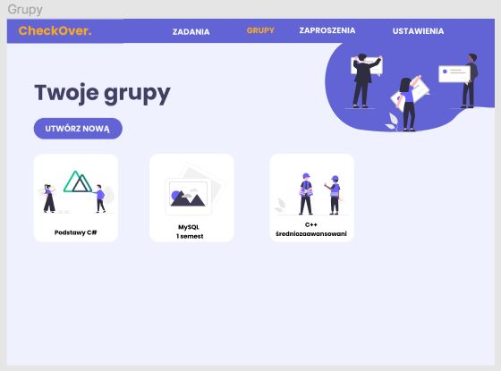
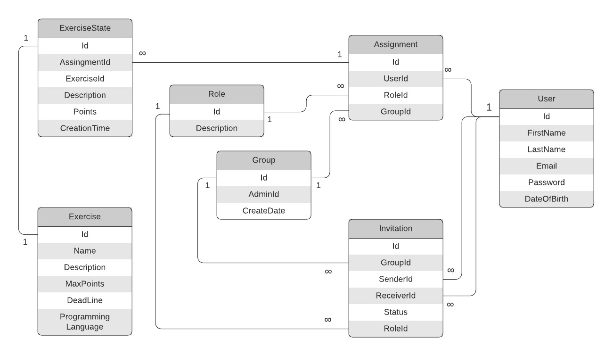

# CheckOver

    </img>
    <h1>Logowanie i rejestracja</h1>
    </img> 
    <h1>Zadania</h1>
    </img>
    <h1>Widok grupy</h1>
    </img>
    <h1>Dodawanie i oddawanie zadania</h1>
    </img> 
    <h1>Poprawione zadanie</h1>
    </img> 
    <h1>Grupy</h1>
    </img> 
    <h1>Schemat bazy danych</h1>
    </img>

     <b>Cel aplikacji   </b>                        	
Aplikacja służy do ułatwienia kontrolowania odrabiania oraz oceniania prac domowych.
  
     <b> Schemat działania</b>    
W aplikacji należy się zarejestrować, nastepnie prowadzący 
grupy (prawdopodobnie koordynator przedmiotu) dodaje użytkowników którym może nadać
różne role, może dodać osobę która pomoże mu sprawdzać prace 
(prawdopodobnie innego prowadzącego danego przedmiotu)
lub osobę która ma wysyłać zadania (ucznia).
  
<b>   Zadania</b>  
Każde zadanie w grupie zamieszcza osoba do tego upoważniona, dodaje punktacje oraz deadline.
 
 <b>  Sprawdzanie </b> 
Początkowo sprawdzać będzie to osoba do tego upoważniona z czasem być może uda się wprowadzić sprawdzanie automatyczne. 
 
 <b> Ocenianie</b> 
Skala punktowa
 
 <b>  Zaproszenia</b> 
Zaproszenie do grupy wysyła osoba która stworzyla grupę lub osoba do tego upoważniona, w zaproszeniu należy podać osobę, grupę oraz role którą tej osobie przydzielamy.
 
<b>  Dodatkowe funkcje</b> 
Rankingi osób pod względem liczby punktów uzyskanej za zadania
  

      
